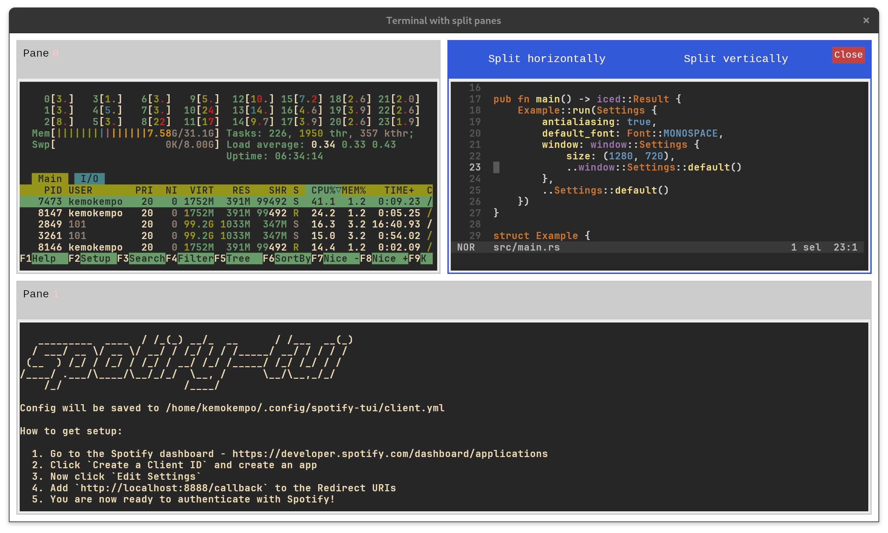

<div align="center">


# iced_term


Terminal emulator widget powered by ICED framework and alacritty terminal backend.

<a href="./examples/full_screen">
  
</a>
<a href="./examples/split_view/assets/screenshot.png">
  
</a>

</div>

## Features

The widget is currently under development and does not provide full terminal features make sure that widget is covered everything you want.

- PTY content rendering
- Multiple instance support
- Basic keyboard input
- Resizing
- Scrolling
- Focusing

This widget tested on MacOS and Linux and is not tested on Windows.

## Installation

```toml
iced_term = "0.2.0"
```

## Overview

Interacting with the widget is happened via:

**Commands** - you can send commands to widget for changing the widget state.

```rust
#[derive(Debug, Clone)]
pub enum Command {
    InitBackend(Sender<alacritty_terminal::event::Event>),
    WriteToBackend(Vec<u8>),
    Scroll(i32),
    Resize(Size<f32>),
    ProcessBackendEvent(alacritty_terminal::event::Event),
}
```

**Events** - widget is produced some events that can be handled in application. Every event has the first `u64` argument that is **terminal instance id**

```rust
#[derive(Debug, Clone)]
pub enum Event {
    Scrolled(u64, f32),
    Resized(u64, Size<f32>),
    Ignored(u64),
    InputReceived(u64, Vec<u8>),
    BackendEventSenderReceived(u64, Sender<alacritty_terminal::event::Event>),
    BackendEventReceived(u64, alacritty_terminal::event::Event),
}
```

For creating workable widget instance you need to do a few steps:

Import widget

```rust
use iced_term;
```

Add widget to your app struct

```rust
struct App {
    term: iced_term::Term,
}
```

Create pure instance in app constructor

```rust
impl Application for App {
    type Executor = executor::Default;
    type Message = Message;
    type Theme = Theme;
    type Flags = ();

    fn new(_flags: ()) -> (Self, Command<Message>) {
        let system_shell = std::env::var("SHELL")
            .expect("SHELL variable is not defined")
            .to_string();
        let term_id = 0;
        let term_settings = iced_term::TermSettings {
            font: iced_term::FontSettings {
                size: 14.0,
                ..iced_term::FontSettings::default()
            },
            backend: iced_term::BackendSettings {
                shell: system_shell.to_string(),
                ..iced_term::BackendSettings::default()
            },
        };

        (
            Self {
                term: iced_term::Term::new(term_id, term_settings.clone()),
            },
            Command::none(),
        )
    }
}
```

Add message that contained widget events to application message enum

```rust
#[derive(Debug, Clone)]
pub enum Message {
    // ... other messages
    IcedTermEvent(iced_term::Event),
}
```

Add `IcedTermEvent` processing to application `update` method

```rust
impl Application for App {
    // ... other methods
    fn update(&mut self, message: Self::Message) -> Command<Message> {
        match message {
            Message::IcedTermEvent(event) => {
                match event {
                    iced_term::Event::InputReceived(_, input) => {
                        self.term.update(iced_term::Command::WriteToBackend(
                            input,
                        ));
                    },
                    iced_term::Event::Scrolled(_, delta) => {
                        self.term.update(iced_term::Command::Scroll(delta as i32))
                    },
                    iced_term::Event::Resized(_, size) => {
                        self.term.update(iced_term::Command::Resize(size));
                    },
                    iced_term::Event::BackendEventSenderReceived(_, tx) => {
                        self.term.update(iced_term::Command::InitBackend(tx));
                    },
                    iced_term::Event::BackendEventReceived(_, inner_event) => {
                        self.term.update(
                            iced_term::Command::ProcessBackendEvent(
                                inner_event,
                            ),
                        );
                    },
                    iced_term::Event::Ignored(_) => {},
                };

                Command::none()
            },
        }
    }
}
```

Add view to your application

```rust
impl Application for App {
    // ... other methods
    fn view(&self) -> Element<Message, iced::Renderer> {
        container(iced_term::term_view(&self.term).map(Message::IcedTermEvent))
            .width(Length::Fill)
            .height(Length::Fill)
            .into()
    }
}
```

Activate backend events subscription in your app

```rust
impl Application for App {
    // ... other methods
    fn subscription(&self) -> Subscription<Message> {
        self.term.subscription().map(Message::IcedTermEvent)
    }
}
```

Run your application

```shell
cargo run --release
```

You can also look at [examples](./examples) directory for more information about widget using.

## Dependencies

 - [iced (0.10.0)](https://github.com/iced-rs/iced/tree/master)
 - [alacritty_terminal (0.20.0)](https://github.com/alacritty/alacritty/tree/master/alacritty_terminal)
 - [tokio (1.23.0)](https://github.com/tokio-rs/tokio)
